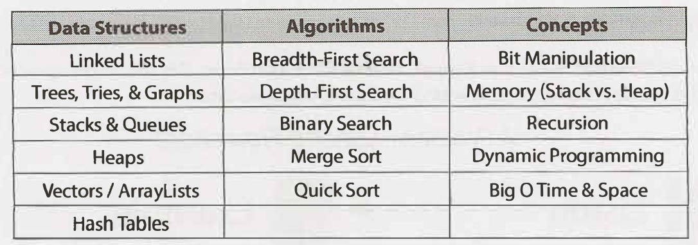

# interview-prep

Feel free to add you own resources :)

TOC:

- [interview-prep](#interview-prep)
    - [Questions](#questions)
    - [Resources](#resources)
  - [Coding Interview](#coding-interview)
    - [Javascript](#javascript)
    - [Computer Science](#computer-science)
  - [System Design Interview](#system-design-interview)
  - [HR interview](#hr-interview)
    - [Questions Banks](#questions-banks)

### Questions

This is an interview questions bank, which i keep on filling every time i see a worthy question in my study sessions.
Please enter your questions as well, so we could all have a variety of questions to practice from.

- [My Question Bank](question-bank/index.md)

### Resources

- [Books](resources/books.md)
- [Articles](resources/articles.md)
- [Courses](resources/courses.md)
- [Lectures](resources/lectures.md)
- [Podcasts](resources/podcasts.md)
- [Practice](resources/practice.md)
- [Repos](resources/repos.md)
- [External Question Banks](resources/question-banks.md)

## Coding Interview

### Javascript

- [var vs let vs const](coding/javascript/variables.md)
- [use strict](coding/javascript/strict-mode.md)
- [IIFEs](coding/javascript/IIFE.md)
- [event loop (libuv, v8)](coding/javascript/event-loop.md)
- [closures](coding/javascript/closures.md)
- [async programming (callbacks, promises, async-await)](coding/javascript/asyncProg.md)
- classical inheritance and prototypal inheritance
- functional programming with javascript

### Computer Science

- [Time Complexity](coding/computer-science/Time-Complexity.md)
- [Sorting Methods - WIP](coding/computer-science/Sorting-Methods.md)
- [Arrays and string](coding/computer-science/Arrays-and-Strings.md)
- [Linked Lists](coding/computer-science/Linked-lists.md)
- [Stacks and Queues](coding/computer-science/Stacks-and-Queues.md)
- [Trees](coding/computer-science/Trees.md)
- [Graphs - WIP](coding/computer-science/Graphs.md)
- [Trie](coding/computer-science/Trie.md)

## System Design Interview

Recommended [Resources](system-design/Resources.md) for learning and practicing system design.

- [Horizontal vs Vertical Sacling](system-design/Scaling.md)
- [Load Balancing](system-design/Load-Balancing.md)
- [SQL vs noSQL databases](system-design/Databases.md)
- [CAP Theorem](system-design/cap-theorem.md)
- [Database Partitaioning - WIP](system-design/Sharding.md)
- [Microservices vs Monolith - WIP](system-design/Microservices.md)
- [Message Queue](system-design/Message-Queue.md)
- [Caching](system-design/Caching.md)
- [Master-Slave Architecture](system-design/master-slave.md)
- [Consistent Hashing - WIP](system-design/consistent-hashing.md)
- [ZooKeeper](system-design/ZooKeeper.md)
- [CDN](system-design/cdn.md)

## HR interview

### Questions Banks

- [Common Behavioral Questions](https://yangshun.github.io/tech-interview-handbook/behavioral-questions/)
- [7 שאלות מכשילות בראיונות עבודה](https://bit.ly/35LmdcE)
- [איך עוברים ראיון משאבי אנוש](https://www.dialog.co.il/new-world/work-search/blogs/hr-interview-part-1/)
- [7 שאלות לראיונות עבודה](https://bit.ly/2YR9TGb)
- [Linkedin's interview prepration feature](<https://www.linkedin.com/interview-prep/assessments/urn:li:fs_assessment:(1,a)/question/urn:li:fs_assessmentQuestion:(10011,aq11)/>)
