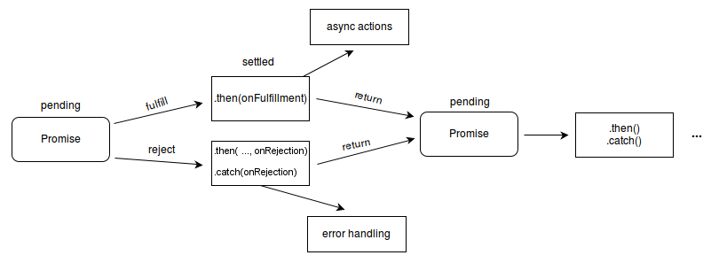

## Asynchronous Programming

Asynchronous programming is a programming paradigm in which the flow of execution of a program is not determined by the sequential order of instructions, but rather by external events, such as the completion of an I/O operation or the firing of a timer.

n asynchronous programming, you can use techniques such as callbacks, events, and promises to write code that can run concurrently with other code, rather than being blocked by long-running operations. This allows you to write more efficient programs, as you can take advantage of idle time and avoid blocking the main thread of execution.

### Callbacks

A callback is a function that is passed as an argument to another function and is executed after the outer function has completed.
Callbacks are often used in javascript to handle asynchronous operations, as they allow you to specify code that should be run after an asyncronous operation has completed.

an example:

```JavaScript
function getData(callback) {
  const xhr = new XMLHttpRequest();
  xhr.open('GET', 'http://example.com/data');
  xhr.onload = () => {
    if (xhr.status === 200) {
      callback(null, xhr.response);
    } else {
      callback(new Error(xhr.statusText));
    }
  };
  xhr.onerror = () => {
    callback(new Error('Network Error'));
  };
  xhr.send();
}

getData((error, data) => {
  if (error) {
    console.error(error);
  } else {
    console.log(data);
  }
});
```

<details>
<summary>explanation</summary>

In this example, the getData function makes an HTTP request to a server and passes the response data to a callback function that is provided as an argument. The callback function is called with two arguments: an `error` object and the response data. If the HTTP request was successful, the `error` argument will be null and the `data` argument will contain the response data. If the request was unsuccessful, the `error` argument will contain an error object and the `data` argument will be undefined.

</details>

#### Callback Hell

One of the main disadvantages of using callbacks to handle asynchronous operations is that they can lead to callback hell, which can make your code harder to read and maintain.
"Callback hell" is a term used to describe code that has become deeply nested due to the use of multiple callback functions. This can happen when you have to chain together multiple asynchronous operations, as each operation requires its own callback function to be specified.

```JavaScript
asyncOperation1((error, result1) => {
  if (error) {
    console.error(error);
    return;
  }
  asyncOperation2(result1, (error, result2) => {
    if (error) {
      console.error(error);
      return;
    }
    asyncOperation3(result2, (error, result3) => {
      if (error) {
        console.error(error);
        return;
      }
      // do something with result3
    });
  });
});

```

### Promises

Promises are one way to handle asynchronous operations in JavaScript. Each promise represents a single operation.
It’s made to solve the problem of combining multiple pieces of asynchronous code in a clean way.
With promises, we can avoid nesting callbacks too deeply.

Promises allow you to write code that will run in the future, after a certain event or operation has completed. They are created using the Promise constructor, which takes a function called the "executor function" as an argument. The executor function is responsible for starting the asynchronous operation and for resolving or rejecting the promise based on the outcome of the operation.

```Javascript
const myPromise = new Promise((resolve, reject) => {
  const xhr = new XMLHttpRequest();
  xhr.open('GET', 'http://example.com/data');
  xhr.onload = () => {
    if (xhr.status === 200) {
      resolve(xhr.response);
    } else {
      reject(new Error(xhr.statusText));
    }
  };
  xhr.onerror = () => {
    reject(new Error('Network Error'));
  };
  xhr.send();
});
```

<details>
<summary>explanation</summary>

In this example, the promise is created using the Promise constructor, and the executor function makes an HTTP GET request to a server and resolves or rejects the promise based on the response.

</details>

Promises have 3 states. They can be **pending**, which means the outcome isn’t known yet since the operation hasn’t start yet.
It can be **fulfilled**, which means that the asynchronous operation is successful and we have the result.
It can also be **rejected**, which means that it failed and has a reason for why it failed.
A promise can be settled, which means that it’s either fulfilled or rejected.

Once a promise has been created, you can use its then method to specify what should happen when the promise is fulfilled or rejected. The then method takes two arguments: a "fulfillment handler" and a "rejection handler." The fulfillment handler is a function that will be called if the promise is fulfilled, and the rejection handler is a function that will be called if the promise is rejected.

```JavaScript
myPromise.then(
  (result) => {
    // this function will be called if the promise is fulfilled
    console.log(result);
  },
  (error) => {
    // this function will be called if the promise is rejected
    console.error(error);
  }
);
```

Promises also have a catch method that you can use to handle rejected promises. The catch method is just a shorthand for calling the then method and only providing a rejection handler.

```JavaScript
myPromise.catch((error) => {
  console.error(error);
});
```

the lifecycle of a Promise:



### async/await

The async/await syntax is a way to write asynchronous code in JavaScript that is easier to read and more intuitive than using callback functions or promises. It was introduced in ECMAScript 2017 and is built on top of promises.

To use async/await, you first need to mark a function as async by adding the async keyword before the function definition. This allows you to use the await keyword inside the function.

```JavaScript
async function getData() {
  const response = await fetch('http://example.com/data');
  const data = await response.json();
  return data;
}

const data = await getData();
console.log(data);
```

<details>
<summary>explanation</summary>

the getData function uses the fetch function to make an HTTP request to a server and returns the response data. The await keyword is used to pause the execution of the function until the fetch function returns a response. Once the response is received, the await keyword is used again to pause the execution of the function until the response is converted to JSON.

</details>

The async/await syntax makes it easier to write asynchronous code that is easy to read and understand. It allows you to write asynchronous code that looks and behaves like synchronous code, which can make it easier to write and debug.

### Further Read

- https://medium.com/codingthesmartway-com-blog/async-programming-with-javascript-callbacks-promises-and-async-await-980e3f144185
- https://developer.mozilla.org/en-US/docs/Web/JavaScript/Reference/Global_Objects/Promise
- https://medium.com/javascript-in-plain-english/truly-understanding-promises-in-javascript-cb31ee487860
- https://medium.com/javascript-scene/master-the-javascript-interview-what-is-a-promise-27fc71e77261
- https://medium.com/better-programming/understanding-promises-in-javascript-13d99df067c1
- https://medium.com/better-programming/an-introduction-to-promises-in-javascript-a29bfdad4643
